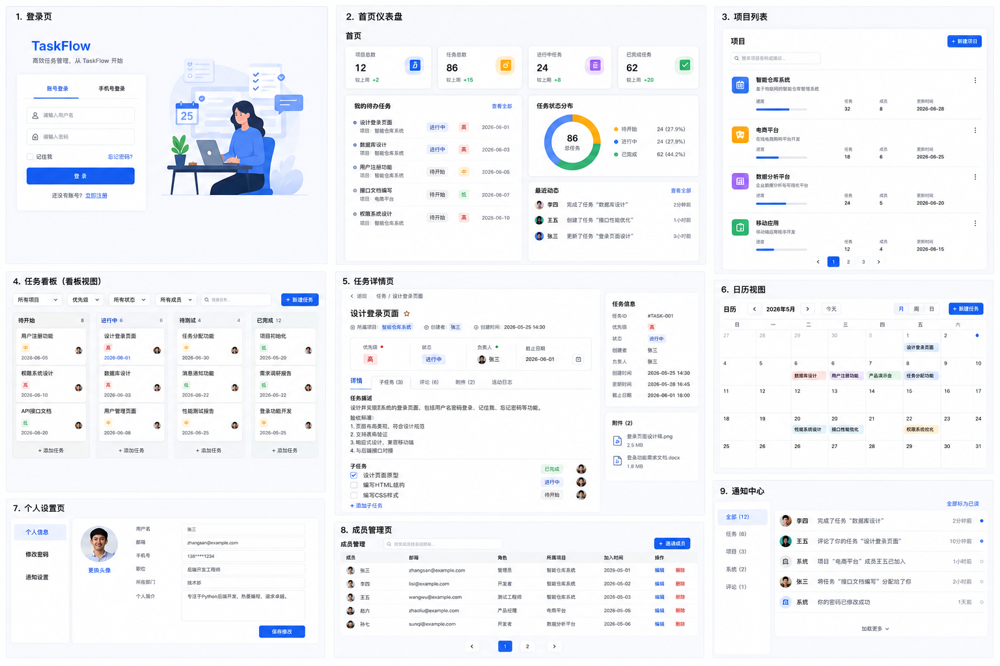

# TaskFlow

> 一个基于 Vue 3、Flask 与 MySQL 的轻量级团队任务协作原型。

TaskFlow 提供用户注册/登录、项目创建、项目概览以及任务统计等基础能力。前端通过 Vite 提供开发服务器，后端以 Flask Blueprint 组织 API，并使用 MySQL 保存用户、项目和任务数据。



## 功能概览

- 用户注册与登录（登录状态保存在浏览器 `sessionStorage`）
- 首页统计：项目总数、任务总数、进行中任务和已完成任务
- 项目列表查询与新建项目
- 任务看板、日历、成员、报表和设置页面路由
- 基于 ECharts 的任务状态分布图

> 当前仓库是一个持续开发中的原型；部分页面已有路由和界面，尚未连接完整后端接口。

## 技术栈

| 层级 | 技术 |
| --- | --- |
| 前端 | Vue 3、TypeScript、Vite、Vue Router、VueUse、ECharts |
| 后端 | Python、Flask、Flask-CORS、PyMySQL |
| 数据库 | MySQL 8.0+ |

## 项目结构

```text
TaskFlow/
├── backend/
│   ├── main.py                # Flask 启动入口（默认端口 5143）
│   └── app/
│       ├── __init__.py        # 应用工厂、CORS 与 Blueprint 自动注册
│       ├── user.py            # 用户查询与注册接口
│       ├── home.py            # 首页聚合统计接口
│       └── project.py         # 项目查询与创建接口
├── frontend/
│   ├── src/
│   │   ├── compontents/       # 当前页面组件（目录名以仓库现状为准）
│   │   ├── router/            # Vue Router 路由定义
│   │   └── utils/             # 请求和前端数据处理工具
│   ├── package.json
│   └── vite.config.ts
├── docs/
│   ├── architecture.md        # 历史架构草案（与当前实现存在差异）
│   └── frontend-ui/           # 界面截图
└── README.md
```

## 环境要求

- Node.js：`^22.18.0` 或 `>=24.12.0`（以 `frontend/package.json` 为准）
- npm：随 Node.js 安装
- Python：3.10+
- MySQL：8.0+

## 快速开始

### 1. 克隆仓库

```bash
git clone <你的仓库地址>
cd xm
```

### 2. 准备 MySQL 数据库

创建数据库，并使用 UTF-8 字符集：

```sql
CREATE DATABASE xm DEFAULT CHARACTER SET utf8mb4 COLLATE utf8mb4_unicode_ci;
```

当前后端直接使用 `user`、`project`、`project_member` 和 `task` 四张表，但仓库尚未提供可执行的初始化脚本。请根据以下字段约定创建本地开发表：

| 表 | 当前代码读取/写入的字段 |
| --- | --- |
| `user` | `username`、`password`、`created_at`、`token` |
| `project` | `name`、`description`、`owner`、`status`、`created_at` |
| `project_member` | 项目成员数据（当前仅查询并返回） |
| `task` | `project_name`、`assignee`、`title`、`status`、`deadline` |

以下是**仅用于本地体验**的最小建表参考；可按实际业务补充主键、外键和索引：

```sql
USE xm;

CREATE TABLE `user` (
  `id` BIGINT UNSIGNED NOT NULL AUTO_INCREMENT,
  `username` VARCHAR(64) NOT NULL,
  `password` VARCHAR(255) NOT NULL,
  `created_at` DATETIME NOT NULL,
  `token` VARCHAR(128) NOT NULL,
  PRIMARY KEY (`id`),
  UNIQUE KEY `uk_user_username` (`username`),
  UNIQUE KEY `uk_user_token` (`token`)
) ENGINE=InnoDB DEFAULT CHARSET=utf8mb4;

CREATE TABLE `project` (
  `id` BIGINT UNSIGNED NOT NULL AUTO_INCREMENT,
  `name` VARCHAR(128) NOT NULL,
  `description` TEXT NULL,
  `owner` VARCHAR(64) NOT NULL,
  `status` VARCHAR(32) NOT NULL DEFAULT '进行中',
  `created_at` DATETIME NOT NULL,
  PRIMARY KEY (`id`)
) ENGINE=InnoDB DEFAULT CHARSET=utf8mb4;

CREATE TABLE `project_member` (
  `id` BIGINT UNSIGNED NOT NULL AUTO_INCREMENT,
  `project_name` VARCHAR(128) NOT NULL,
  `username` VARCHAR(64) NOT NULL,
  PRIMARY KEY (`id`)
) ENGINE=InnoDB DEFAULT CHARSET=utf8mb4;

CREATE TABLE `task` (
  `id` BIGINT UNSIGNED NOT NULL AUTO_INCREMENT,
  `project_name` VARCHAR(128) NOT NULL,
  `assignee` VARCHAR(64) NOT NULL,
  `title` VARCHAR(255) NOT NULL,
  `status` VARCHAR(32) NOT NULL DEFAULT 'doing',
  `deadline` DATETIME NULL,
  PRIMARY KEY (`id`)
) ENGINE=InnoDB DEFAULT CHARSET=utf8mb4;
```

### 3. 配置后端数据库连接

后端当前在 `backend/app/user.py`、`backend/app/home.py` 和 `backend/app/project.py` 中直接创建 PyMySQL 连接。启动前，请将其中的 MySQL 主机、端口、用户名、密码和数据库名改为你的本地环境配置。

> **安全提示：** 仓库当前含有硬编码数据库凭据。请勿在生产环境使用这一做法；应立即替换现有凭据，并后续迁移至 `.env` 和集中配置模块。`.env` 已被 `.gitignore` 忽略，不要将真实凭据提交到版本库。

### 4. 安装并启动后端

在第一个终端中执行：

```bash
cd backend
python -m venv .venv
```

激活虚拟环境：

```bash
# Windows PowerShell
.\.venv\Scripts\Activate.ps1

# macOS / Linux
source .venv/bin/activate
```

安装运行所需依赖并启动 Flask：

```bash
pip install Flask Flask-Cors PyMySQL
python main.py
```

服务默认监听 `http://127.0.0.1:5143`。访问以下地址确认服务可用：

```text
http://127.0.0.1:5143/
```

预期响应包含 `"status": "ok"` 与 `"message": "Flask 服务运行中"`。

### 5. 安装并启动前端

在第二个终端中执行：

```bash
cd frontend
npm ci
npm run dev
```

打开 Vite 输出的本地地址（通常是 `http://localhost:5173`），进入登录页后可注册一个测试账号并跳转到首页。

## 使用示例

### 在浏览器中操作

1. 确保 MySQL、后端和前端均已启动。
2. 打开前端开发服务器地址。
3. 在登录页面点击“立即注册”，填写用户名与密码。
4. 注册完成后，应用会生成一个本地会话 Token 并进入首页。
5. 在“项目”页面点击“新建项目”，填写项目名称和描述后提交。
6. 返回首页查看项目数、任务数和任务状态图。

### 使用 API

所有现有 API 均以 `http://127.0.0.1:5143/api` 为前缀。

| 方法 | 路径 | 说明 |
| --- | --- | --- |
| `GET` | `/user` | 获取当前全部用户（仅开发调试） |
| `POST` | `/login` | 注册用户并写入 Token |
| `GET` | `/home` | 获取当前用户首页聚合数据，需要 `token` 请求头 |
| `GET` | `/project` | 获取项目与成员数据，需要 `token` 请求头 |
| `POST` | `/project` | 创建项目，请求体中携带 `token` |

注册测试用户：

```bash
curl -X POST http://127.0.0.1:5143/api/login \
  -H "Content-Type: application/json" \
  -d '{
    "username": "demo",
    "password": "change-me",
    "created_at": "2026-09-12 12:00:00",
    "token": "demo-token-001"
  }'
```

使用 Token 查询项目：

```bash
curl http://127.0.0.1:5143/api/project \
  -H "token: demo-token-001"
```

创建项目：

```bash
curl -X POST http://127.0.0.1:5143/api/project \
  -H "Content-Type: application/json" \
  -d '{
    "token": "demo-token-001",
    "name": "示例项目",
    "description": "用于验证本地安装流程",
    "owner": "demo",
    "created_at": "2026-09-12 12:00:00"
  }'
```

## 可用脚本

在 `frontend/` 目录执行：

| 命令 | 说明 |
| --- | --- |
| `npm run dev` | 启动 Vite 开发服务器 |
| `npm run build` | 运行 TypeScript 类型检查并构建生产文件 |
| `npm run preview` | 本地预览已构建的前端产物 |

后端目前没有 `requirements.txt`、测试脚本或生产部署脚本；依赖和启动命令见“快速开始”。

## 开发说明与已知限制

- 前端 API 地址目前固定为 `http://127.0.0.1:5143/api`，定义在 `frontend/src/utils/request.ts`；部署前应改为环境变量。
- 后端通过扫描 `backend/app/` 下的模块并自动注册以 `_api` 结尾的 Flask Blueprint。
- 认证为原型实现：前端会读取全部用户并在浏览器中比较明文密码，Token 也由前端生成；**不适合生产环境**。
- 后端数据库连接、CORS 配置和错误处理仍需生产化改造，例如集中配置、密码哈希、服务端鉴权、严格 CORS 规则、输入校验与连接释放。
- `docs/architecture.md` 描述了 FastAPI、Redis、Docker 和 ORM 等规划内容，但这些组件不在当前仓库实现中。以本 README 和实际代码为准。

## 贡献指南

欢迎通过 Issue 和 Pull Request 改进 TaskFlow。

1. Fork 本仓库并创建功能分支：

   ```bash
   git checkout -b feat/short-description
   ```

2. 保持改动聚焦：一个 PR 只解决一个清晰的问题或功能。
3. 前端改动后，在 `frontend/` 执行：

   ```bash
   npm run build
   ```

4. 后端改动后，至少确认服务可启动，并访问 `http://127.0.0.1:5143/` 检查健康响应。
5. 不要提交真实密码、数据库凭据、`.env` 文件、构建产物或 `node_modules`。
6. 在 PR 描述中说明：变更目的、验证方式、涉及的接口或页面；如修改 UI，请附截图。
7. 提交信息建议使用简洁的约定式前缀，例如 `feat:`、`fix:`、`docs:`、`refactor:`。

### 推荐优先改进项

- 将数据库配置迁移到环境变量，并新增 `backend/requirements.txt` 与 `.env.example`
- 使用密码哈希和服务端登录接口替换前端明文校验
- 为 API 补充请求校验、统一错误响应与自动化测试
- 将 API 基地址改为 Vite 环境变量，并完善任务、成员和通知接口
- 更新 `docs/architecture.md`，使其与实际 Flask 实现一致

## 许可证

本项目采用 [Apache License 2.0](LICENSE)。
